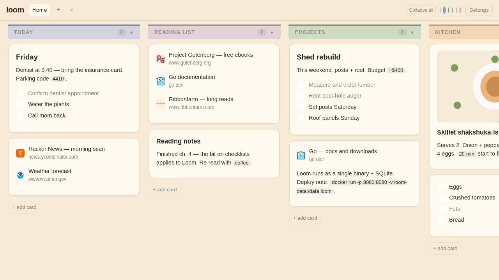
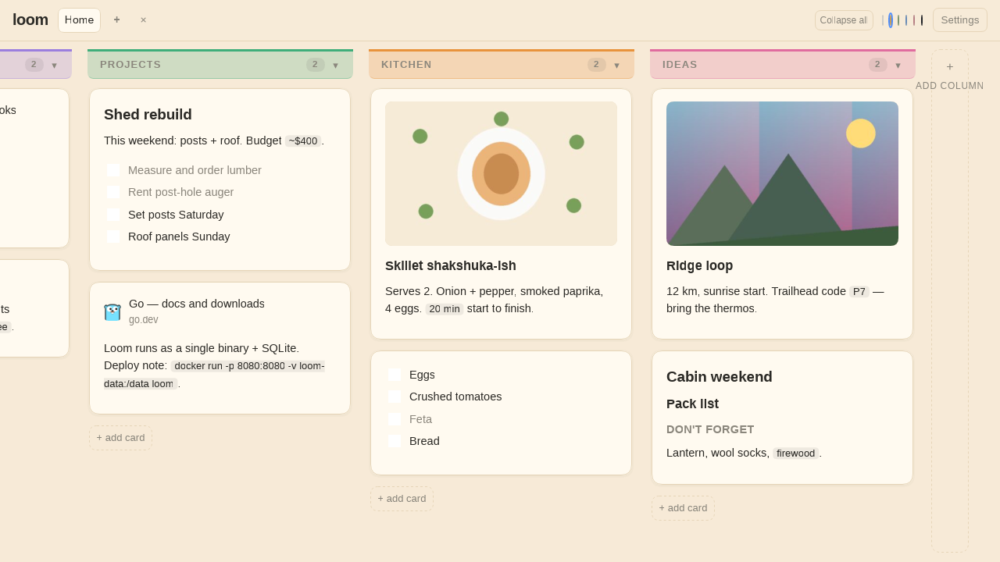

<div align="center">

# Loom

[Quick Start](#quick-start) • [Features](#features) • [Configuration](#configuration) • [Usage](#usage-guide)

[Optional login](#optional-login) • [Demo data](#demo-data) • [Development](#development) • [Contributing](#contributing)

MIT License — free as in freedom
</div>

---

A self-hosted, minimal personal boards app for links and notes. Boards
hold columns, columns hold cards, and each card holds an ordered mix of
links, markdown notes, todo checklists, and images. One small Go binary,
no framework JavaScript, your data in a single SQLite file.



*Above: a lived-in board — markdown notes, link lists, todo checklists.
Below: the same board scrolled right — uploaded images, groceries,
weekend plans.*



---

### Features

- **Boards, columns, cards** — switch boards from the navbar; collapse
  columns into slim rails when you need focus.
- **Four block types per card** — `link` lists with auto-fetched site
  icons, `note` blocks with markdown (`#`/`##`/`###` headers, `**bold**`,
  `*italic*`, `` `code` ``), `todo` checklists (one block = one list,
  Enter adds the next item), and `image` blocks via upload or URL.
- **Drag and drop** — cards within and across columns, blocks via their
  handle, columns by their header; drop a card onto the navbar board
  strip to copy or move it to another board.
- **Inline everything** — click any text to edit, blur commits; compact
  `+ card` / `+ link` / `+ note` / `+ image` adders everywhere.
- **Board backgrounds + column colors** — six paper-like board themes,
  per-column color washes that persist.
- **Import / export** — legacy v1 JSON importer (additive-only, link
  dedupe on normalized URL) plus a full v2 export for backups.
- **Optional login** — OpenID Connect, off by default. Turn it on from
  Settings and boards go private with per-board viewer/editor invites.
- **Fast + offline-friendly** — cache-first instant paint, service-worker
  app shell, lazy images.

### Built for performance

- **Lightweight** — single Go binary, stdlib `net/http`, SQLite.
- **Minimal footprint** — one Docker image, DB in a `/data` volume.
- **Small client** — initial JS ≤50KB gzipped (currently **33.8KB**;
  re-check with `sh scripts/budget-check.sh`).
- **Instant load** — cache/seed → first paint target <100ms
  (instrumented as `window.__LOOM_FIRST_PAINT_MS`; measure in a live
  tab, never trust a quoted number).

---

## Quick Start

<details>
<summary><strong>🐳 Docker (recommended)</strong></summary>
<br>

```sh
docker build -t loom .
docker run -p 8080:8080 -v loom-data:/data loom
```

Or with Docker Compose (a minimal `compose.yaml` ships in the repo —
same image, same `loom-data` volume on port 8080):

```sh
docker compose up --build -d
docker compose down
```

Open [http://localhost:8080](http://localhost:8080). Your database lives
in the `loom-data` volume (`/data/loom.db` inside the container).

Prebuilt images also publish from `main` as `ghcr.io/crueber/loom:latest`
(plus `sha-<short-SHA>` tags).

<hr>
</details>

<details>
<summary><strong>🏃 Go run (local dev)</strong></summary>
<br>

```sh
# SQLite (same backend Docker uses):
go run ./cmd/loom --addr :8080 --data loom.db --web web

# JSON-file backend (zero dependencies, handy for hacking):
go run ./cmd/loom --addr :8080 --data loom-data.json --web web

# In-memory (no persistence, throwaway tests):
go run ./cmd/loom --addr :8080 --data "" --web web
```

On first run with an empty store, Loom seeds a `Home` board with a
`Start here` column and a welcome card, so a new tab is never empty.

<hr>
</details>

---

## Configuration

No config files, no environment variables. Everything optional lives in
the **Settings dialog** in the UI (theme, language, OIDC provider, login
requirements).

| Flag | Default | Meaning |
|------|---------|---------|
| `--addr` | `:8080` | listen address |
| `--data` | `loom-data.json` | storage: `.db`/`.sqlite`/`.sqlite3` → SQLite, any other path → JSON file, empty → in-memory |
| `--web` | `web` | web assets directory |

Image uploads (jpeg/png/gif, ≤12MB) need the SQLite backend; the
JSON-file backend answers `501` for uploads.

---

## Optional login

Loom is open single-user software out of the box — no account, no
password. If you want private boards and sharing:

1. Open **Settings → Account** and enter your OIDC issuer, client ID,
   and secret (any OpenID Connect provider works).
2. Flip on login. New boards become private automatically; existing
   boards stay public until you change them.
3. Use the per-board **Share dialog** to invite viewers/editors.

Sessions live in an HttpOnly SameSite cookie; theme + language prefs
sync across your devices when signed in.

---

## Usage guide

<details>
<summary><strong>📝 Boards, columns, cards</strong></summary>
<br>

- `+ board` / `+ column` in the navbar append to the end.
- Click a column header to collapse it to a rail; click empty rail space
  to expand. The header `▾` menu holds color swatches, Rename, Delete.
- `+ card` sits at the bottom of every column; each card offers
  `+ link` / `+ note` / `+ image` (and `Todo…` for checklists).
- The card toolbar appears on hover/focus; deleting asks via a confirm
  dialog (Esc cancels, nothing is deleted).
- Rename the board or delete it from **Settings → General**.

<hr>
</details>

<details>
<summary><strong>🎯 Organizing</strong></summary>
<br>

- Drag cards within or across columns; drag blocks by their slim handle
  to reorder within or across cards; drag columns by the header.
- Drag a card onto the navbar board strip to copy/move it to another
  board (uses the existing create + delete APIs).
- Drag a column's header handle to resize it (widths persist locally);
  double-click the handle resets to standard width.
- Todo blocks: Enter adds the next item ready to type, Escape exits,
  checkbox toggles save.

<hr>
</details>

<details>
<summary><strong>💾 Import / export</strong></summary>
<br>

- **Settings → Data** imports a v1 legacy JSON export as a new board
  tree (never modifies existing data; links dedupe on normalized URL).
- `GET /api/export` returns a full v2 backup (all boards + trees).

<hr>
</details>

---

## Demo data

The screenshots above come from a small demo board. Rebuild it on any
fresh server (SQLite backend, since two cards use uploaded images):

```sh
go run ./cmd/loom --addr 127.0.0.1:8080 --data /tmp/demo.db --web web &
python3 scripts/seed-demo.py --base http://127.0.0.1:8080
```

The script uses the auto-seeded `Home` board, refuses to run when that
board already holds content, and needs only the Python standard library
(images live in `scripts/seed-demo-assets/`).

---

## Development

```sh
gofmt -l . && go vet ./... && go build ./... && go test ./... && sh scripts/budget-check.sh
```

Run the full line before pushing. Conventions (branches, Forgejo PRs,
one worktree per feature, JS budget, claim verification) live in
[`AGENTS.md`](AGENTS.md); the terse per-feature list is
[`FEATURES.md`](FEATURES.md) — every feature change updates it in the
same commit.

---

## Contributing

Suggestions and bug reports are welcome via Forgejo issues. If you want
a new feature, file the request first and work through the details
before sending a PR — unsolicited PRs will most likely just be closed.

Guiderails for submissions:

- No new dependencies unless strictly necessary.
- No backward-incompatible changes without migrations.
- Provide a screenshot of UI changes in the PR.

---

<div align="center">

Single binary, vanilla JS, SQLite — your links, notes, and weekends.

**[⬆ Back to top](#loom)**

</div>
