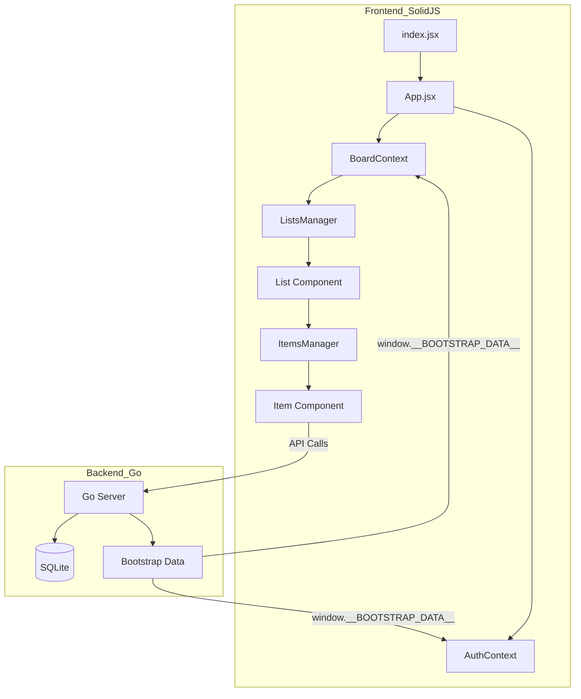

# Migration Plan: Alpine.js to SolidJS

## Overview
Transition the Loom frontend from Alpine.js (DOM-based reactivity) to SolidJS (JSX-based fine-grained reactivity). This will move templates out of `index.html` and into modular JSX components, improving maintainability while preserving the minimal footprint and performance.

## Phase 1: Infrastructure
- [ ] Update `cmd/server/package.json` to include `solid-js` and `esbuild` plugins for JSX.
- [ ] Modify `cmd/server/build.js` to handle `.jsx` files and SolidJS transformations.
- [ ] Create a root entry point `src/index.jsx` to mount the SolidJS app.

## Phase 2: Component Migration
- [ ] **Auth**: Convert `auth.js` to a SolidJS Context or Store for global user state.
- [ ] **Boards**: Convert `boards.js` and its `index.html` templates to `<BoardsManager />` component.
- [ ] **Lists**: Convert `lists.js` and its `index.html` templates to `<ListsManager />` and `<List />` components.
- [ ] **Items**: Convert `items.js` and its `index.html` templates to `<ItemsManager />` and `<Item />` components.
- [ ] **Utilities**: Adapt `dragScroll.js` and `flipCard.js` to work with SolidJS refs and lifecycle.

## Phase 3: Data & Events
- [ ] Replace `window.__BOOTSTRAP_DATA__` event-based loading with direct SolidJS store initialization.
- [ ] Refactor the `Events` registry to use SolidJS signals or a simple pub/sub if cross-component communication outside the hierarchy is still needed.

## Phase 4: Cleanup
- [ ] Remove Alpine.js from `static/lib/`.
- [ ] Strip Alpine directives (`x-data`, `x-show`, `x-for`) from `index.html`.
- [ ] Update `AGENTS.md` and `.roo/rules-*/AGENTS.md` with SolidJS-specific patterns.

## Mermaid Diagram: New Architecture

